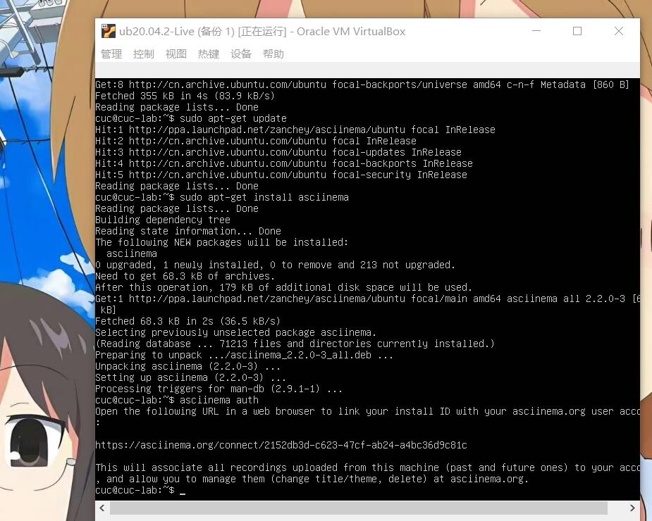
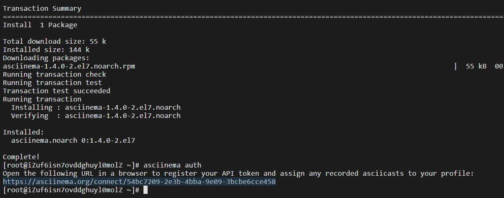
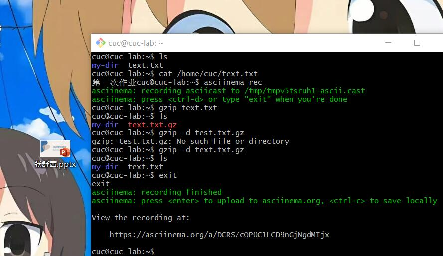
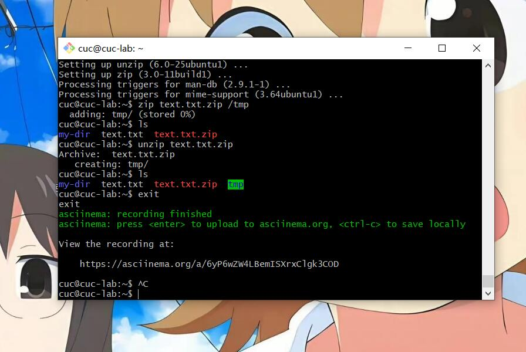
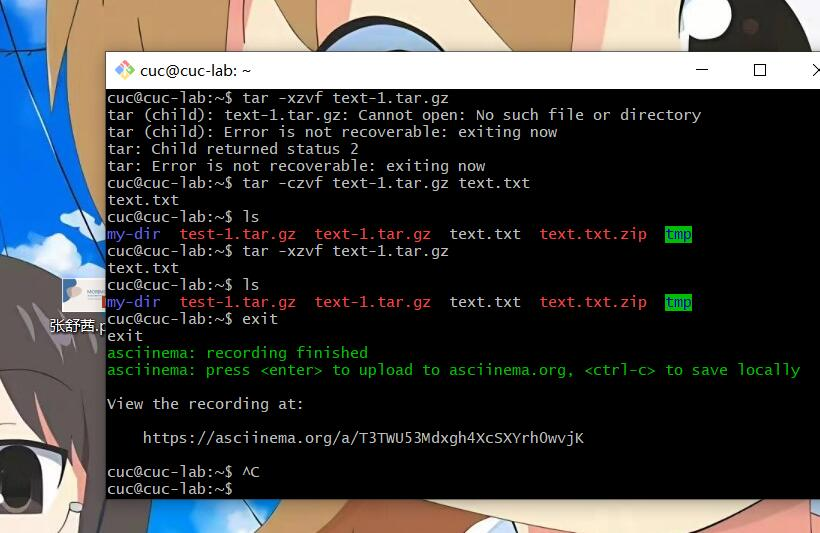
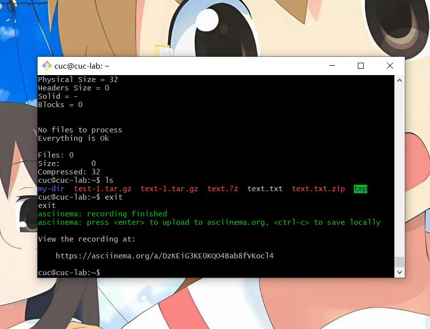
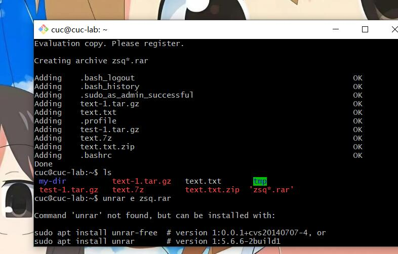

# 第二次实验

## 实验问题

**使用表格方式记录至少 2 个不同 Linux 发行版本上以下信息的获取方法，使用 asciinema录屏方式「分段」记录相关信息的获取过程和结果**

|       版本号       | ubuntu 20.04 | CentOS 7.7 |
| :----------------: | :----------: | :----: |
|        安装        |     sudo apt install XXX         | yum install xxx |
|      安装路径      | which XXX | which xxx |
|        卸载        | sudo apt-get remove --purge XXX | yum -y remove xxx |
|      验证卸载      | which | which xxx |
| 找特殊文件名的文件 | sudo find ./ -name '*XXX*' | sudo find ./ -name '*XXX* |
|  找特殊内容的文件  | sudo grep -r 'XXX' ./ | sudo grep -r 'XXX' ./ |
|     文件的压缩     | 具体用法见实例 | 具体用法见实例 |
|    文件的解压缩    | 具体用法见实例 | 具体用法见实例 |
|    CPU信息获取     | cat /proc/cpuinfo | cat /proc/cpuinfo |
|      内存大小      | free -h | free -h |
|      硬盘数量以及容量      | df -h/ lsblk | df -h/ lsblk |

## 安装 `asciinema` 

    sudo apt-add-repository ppa:zanchey/asciinema
    sudo apt-get update
    sudo apt-get install asciinema
    asciinema auth

 **要开始录制，请在终端中运行以下命令**

     asciinema rec

 **要结束录制，请在终端中运行以下命令**

     exit

### 在云环境安装`asciinema` ：

    yum install -y  asciinema
    asciinema auth

**要开始录制，请在终端中运行以下命令**

     asciinema rec

 **要结束录制，请在终端中运行以下命令**

     exit

###我的asciinema主页

## 【软件包管理】在目标发行版上安装 tmux 和 tshark ；查看这 2 个软件被安装到哪些路径；卸载 tshark ；验证 tshark 卸载结果 ：

**`tmux`的安装以及查看路径：**

    sudo apt-get install tmux
    which tmux

**`tshark`的安装、路径查看、卸载**

    sudo apt-get install tshark
    which tshark
    sudo apt-get remove --purge tshark

## 在云环境操作：
**`tmux`的安装以及查看路径：**

    yum install tmux
    which tmux

**`tshark`的安装卸载、路径查看**

    yum install wireshark
    which tshark
    yum -y remove wireshark
    which tshark

## 【文件管理】复制以下 shell 代码到终端运行，在目标 Linux 发行版系统中构造测试数据集，然后回答以下问题：1.找到 /tmp 目录及其所有子目录下，文件名包含 666 的所有文件找到 2./tmp 目录及其所有子目录下，文件内容包含 666 的所有文件

**将`shell`代码复制到终端运行：**

    cd /tmp && for i in $(seq 0 1024);do dir="test-$RANDOM";mkdir "$dir";echo "$RANDOM" > "$dir/$dir-$RANDOM";done

    cd /tmp
    sudo find ./ -name '*666*'
    sudo grep -r '666' ./

## 云平台操作：

将`shell`代码复制到终端运行(和之前一样

    cd /tmp && for i in $(seq 0 1024);do dir="test-$RANDOM";mkdir "$dir";echo "$RANDOM" > "$dir/$dir-$RANDOM";done

    cd /tmp
    sudo find ./ -name '*666*'
    sudo grep -r '666' ./

## 【文件压缩与解压缩】练习课件中 文件压缩与解压缩 一节所有提到的压缩与解压缩命令的使用方法

###测试文件为 `text.txt`

**gzip**

    gzip text.txt
    ls
    gzip -d test.txt.gz
    ls

**bzip2**

    bzip2 -z text.txt
    ls
    bzip2 -d text.txt.bz2
    ls

**zip**

    sudo apt install zip #先下载zip
    zip text.txt.zip /tmp
    ls
    unzip text.txt.zip
    ls

**tar**

    tar -czvf text-1.tar.gz text.txt
    ls
    tar -xzvf text-1.tar.gz
    ls

**7z**

    sudo apt install p7zip-full  #先下载7z
    7za a text.7z /text.txt
    ls
    7za x text.7z
    ls

**rar**

    sudo apt autoremove  #先下载rar
    rar a zsq*           #将所有文件压缩成叫zsq的压缩包
    ls
    sudo apt install unrar #下载unrar
    unrar e zsq.rar
    ls

##【硬件信息获取】目标系统的 CPU、内存大小、硬盘数量与硬盘容量

#### 本地虚拟机

获取CPU信息 

    cat /proc/cpuinfo

获取内存信息

    free -h

获取硬盘数量以及容量信息 

    df -h

#### 云平台

获取CPU信息 

    cat /proc/cpuinfo

获取内存信息 

    free -h

获取硬盘数量以及容量信息

    df -h

# 问题与思考

- 一开始写作业的时候一直都是在虚拟机里的ub上进行实验，因为它没有复制粘贴就非常的麻烦。因为已经有了SSH所以可以直接去git bash里面`ssh cuc@192.168.56.101`

- 直接用`yum`安装`tshark`，报错显示找不到。直接根据提示安装wireshark。

# 参考

[linux查找指定内容文件](https://www.cnblogs.com/linjiqin/p/11678012.html)

[linux下各种文件格式的压缩以及解压缩命令](https://www.cnblogs.com/cnland/p/3559042.html)

[linux查看硬盘信息](https://www.php.cn/linux-474598.html)

[Linux系统命令 - 查看内存使用情况](https://blog.csdn.net/renfufei/article/details/105851728)

