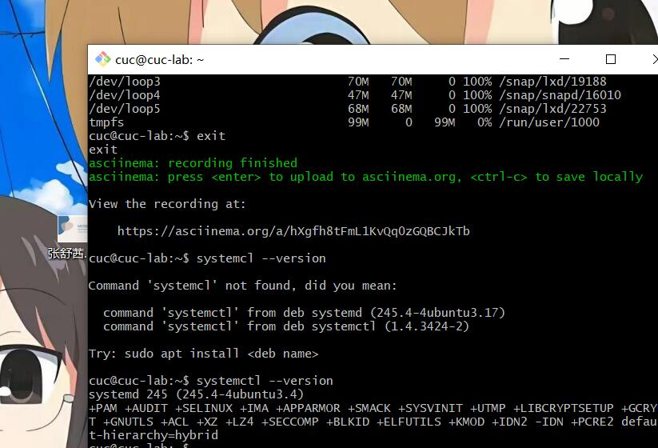
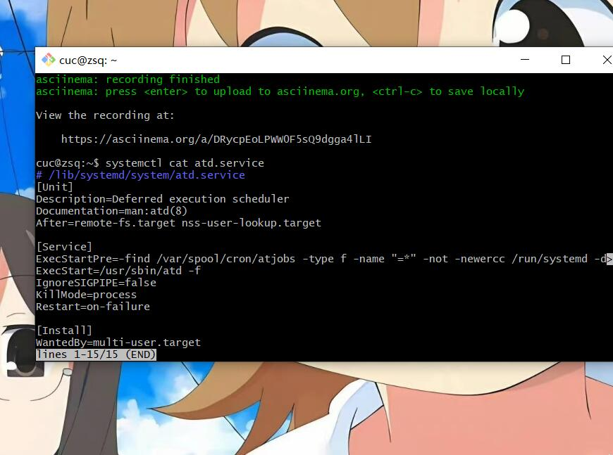
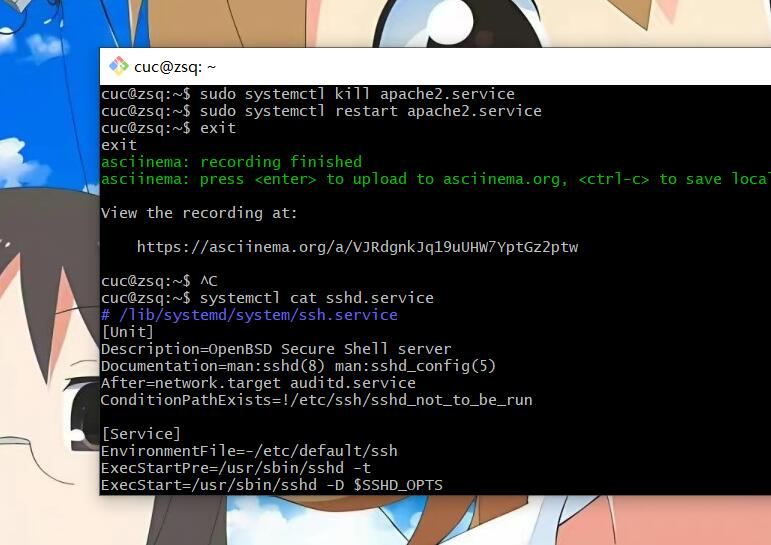
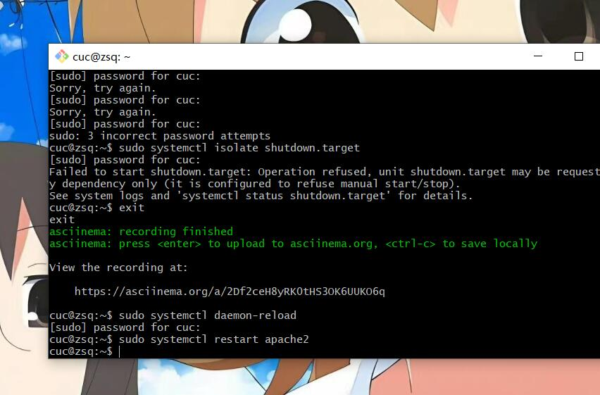
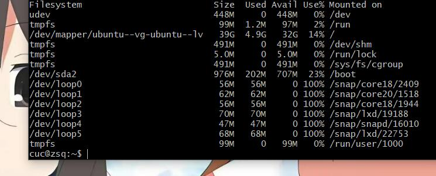
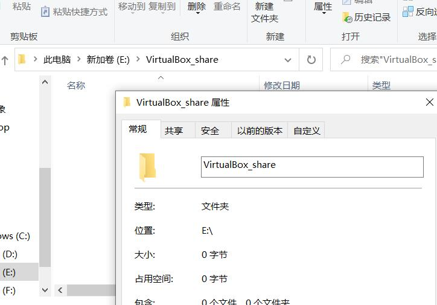
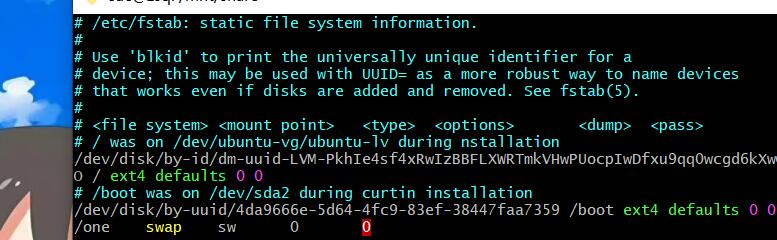
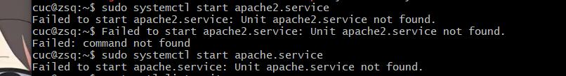

# 第三次作业

## 实验内容
根据Systemd入门教程：命令篇完成相关操作

根据Systemd入门教程：实战篇完成相关操作

##  [`systemd `入门教程：命令篇](http://www.ruanyifeng.com/blog/2016/03/systemd-tutorial-commands.html)

**查看`systemd`的版本**

    systemctl --version

### `systemd-analyze`命令用来查看启动耗时
**查看启动耗时**

    systemd-analyze

**查看每个服务的启动耗时**

    systemd-analyze blame

**显示瀑布状的启动过程流**

    systemd-analyze critical-chain

**显示指定服务的启动流**

    systemd-analyze critical-chain atd.service

### `hostnamectl`查看当前主机信息

**显示当前主机的信息**

    hostnamectl

**设置主机名**

    sudo hostnamectl set-hostname zsq

### `localectl`查看本地化设置

**查看本地化设置**

    localectl

**设置本地化参数**

    sudo localectl set-locale LANG=en_GB.utf8
    sudo localectl set-keymap en_GB

### `timedatectl`查看当前时区设置

**查看当前时区设置**

    timedatectl

**显示所有可用的时区**

    timedatectl list-timezones

**设置当前时区**

    sudo timedatectl set-timezone America/New_York
    sudo timedatectl set-time YYYY-MM-DD
    sudo timedatectl set-time HH:MM:SS

### `loginctl` 查看当前登录的用户

**列出当前`session`**

    loginctl list-sessions

**列出当前登录用户**

    loginctl list-users

**列出显示指定用户的信息**

    loginctl show-user cuc

##unit

Unit 一共分成12种。

- Service unit：系统服务

- Target unit：多个 Unit 构成的一个组

- Device Unit：硬件设备

- Mount Unit：文件系统的挂载点

- Automount Unit：自动挂载点

- Path Unit：文件或路径

- Scope Unit：不是由 Systemd 启动的外部进程

- Slice Unit：进程组

- Snapshot Unit：Systemd 快照，可以切回某个快照

- Socket Unit：进程间通信的 socket

- Swap Unit：swap 文件

- Timer Unit：定时器

### `systemctl list-units`查看当前系统的所有Unit

**列出正在运行的 `Unit`**

    systemctl list-units

**列出所有`Unit`，包括没有找到配置文件的或者启动失败的**

    systemctl list-units --all

**列出所有没有运行的 `Unit`**

    systemctl list-units --all --state=inactive

**列出所有加载失败的 `Unit`**

    systemctl list-units --failed

**列出所有正在运行的、类型为 `service` 的 `Unit`**

    systemctl list-units --type=service

### `systemctl status`查看系统状态和单个Unit 

**显示系统状态**

    systemctl status

**显示单个 `Unit` 的状态**

    systemctl status dbus.service

### `systemctl`提供查询状态的其他三个方法

**显示某个 `Unit` 是否正在运行**

    systemctl is-active application.service

**显示某个 `Unit` 是否处于启动失败状态**

    systemctl is-failed application.service

**显示某个 `Unit` 服务是否建立了启动链接**

    systemctl is-enabled application.service

### `Unit`管理命令

**立即启动一个服务**

    sudo systemctl start apache2.service

**立即停止一个服务**

    sudo systemctl stop apache2.service

**重启一个服务**

    sudo systemctl restart apache2.service

**杀死一个服务的所有子进程**

    sudo systemctl kill apache2.service

**重新加载一个服务的配置文件**

    sudo systemctl reload apache2.service

**重载所有修改过的配置文件**

    sudo systemctl daemon-reload

**显示某个 `Unit` 的所有底层参数**

    systemctl show httpd.service

**显示某个` Unit` 的指定属性的值**

    systemctl show -p CPUShares httpd.service

**设置某个 `Unit` 的指定属性**

    sudo systemctl set-property httpd.service CPUShares=500

### `Unit`的依赖关系

**列出一个 `Unit`的所有依赖**

    systemctl list-dependencies nginx.service

**展开`target`类型的依赖**

    systemctl list-dependencies --all nginx.service

### `systemd`启动 `Unit`

**开机启动**

    sudo systemctl enable apache2.service
    sudo ln -s '/usr/lib/systemd/system/apache2.service'

**撤销开机启动**

    sudo systemctl disable apache2.service

### `systemctl list-unit-files`用于列出所有配置文件 

**列出所有配置文件**

    systemctl list-unit-files

**列出指定类型的配置文件**

    systemctl list-unit-files --type=service

### `systemctl cat`查看配置文件内容

    systemctl cat atd.service

### `target`
**Target 就是一个 Unit 组，包含许多相关的 Unit 。启动某个 Target 的时候，Systemd 就会启动里面所有的 Unit。从这个意义上说，Target 这个概念类似于"状态点"，启动某个 Target 就好比启动到某种状态**

**查看当前系统的所有 `Target`**

    systemctl list-unit-files --type=target

**查看一个 `Target` 包含的所有 `Unit`**

    systemctl list-dependencies multi-user.target

**查看启动时的默认 `Target`**

    systemctl get-default

**设置启动时的默认 `Target`**

    sudo systemctl set-default multi-user.target

**切换 `Target` 时，默认不关闭前一个 `Target` 启动的进程，
`systemctl isolate` 命令改变这种行为,关闭前一个 `Target` 里面所有不属于后一个 `Target `的进程**

    sudo systemctl isolate multi-user.target

### `journalctl`查看所有日志
**Systemd 统一管理所有 Unit 的启动日志。带来的好处就是，可以只用`journalctl`一个命令，查看所有日志（内核日志和应用日志）。日志的配置文件是`/etc/systemd/journald.conf`。`journalctl`功能强大，用法非常多**

**查看所有日志（默认情况下 ，只保存本次启动的日志）**

    sudo journalctl

**查看内核日志（不显示应用日志）**

    sudo journalctl -k

**查看系统本次启动的日志**

    sudo journalctl -b
    sudo journalctl -b -0

**查看上一次启动的日志（需更改设置）**

    sudo journalctl -b -1

**查看指定时间的日志**

    sudo journalctl --since="2022-7-3 18:17:16"
    sudo journalctl --since "20 min ago"
    sudo journalctl --since yesterday
    sudo journalctl --since "2022-07-02" --until "2022-07-03 22:00"
    sudo journalctl --since 09:00 --until "1 hour ago"

**显示尾部的最新10行日志**

    sudo journalctl -n

**显示尾部指定行数的日志**

    sudo journalctl -n 20

**实时滚动显示最新日志**

    sudo journalctl -f

**查看指定服务的日志**

    sudo journalctl /usr/lib/systemd/systemd

**查看指定进程的日志**

    sudo journalctl _PID=1

**查看某个路径的脚本的日志**

    sudo journalctl /usr/bin/bash

**查看指定用户的日志**

    sudo journalctl _UID=33 --since today

**查看某个 `Unit` 的日志**

    sudo journalctl -u nginx.service
    sudo journalctl -u nginx.service --since today

**实时滚动显示某个 `Unit` 的最新日志**

    sudo journalctl -u nginx.service -f

**合并显示多个 `Unit` 的日志**

    journalctl -u nginx.service -u php-fpm.service --since today

**查看指定优先级（及其以上级别）的日志，共有8级**

    sudo journalctl -p err -b

**日志默认分页输出，`--no-pager` 改为正常的标准输出**

    sudo journalctl --no-pager

**以 `JSON` 格式（单行）输出**

    sudo journalctl -b -u nginx.service -o json

**以 `JSON` 格式（多行）输出，可读性更好**

    sudo journalctl -b -u nginx.serviceqq -o json-pretty

**显示日志占据的硬盘空间**

    sudo journalctl --disk-usage

**指定日志文件占据的最大空间**

    sudo journalctl --vacuum-size=1G

**指定日志文件保存多久**

    sudo journalctl--vacuum-time=1years

## [`systemd`入门教程：实战篇](http://www.ruanyifeng.com/blog/2016/03/systemd-tutorial-part-two.html)

### 开机启动、启动服务以及停止服务

    sudo systemctl enable apache2
    sudo systemctl start apache2
    sudo systemctl status apache2
    sudo systemctl stop apache2.service
    sudo systemctl kill apache2.service
    sudo systemctl restart apache2.service

### 查看配置文件

    systemctl cat sshd.service

### 启动的target

**查看 `multi-user.target` 包含的所有服务**

    systemctl list-dependencies multi-user.target

**切换到另一个 `target`**

    sudo systemctl isolate shutdown.target

### 修改配置后重启

**重新加载配置文件**

    sudo systemctl daemon-reload

**重启相关服务**

    sudo systemctl restart apache2

### 如何添加一个用户并使其具备`sudo`执行程序的权限？

    sudo adduser zsq
    sudo usermod -G sudo zsq

    groups zsq

### 如何查看当前系统的分区表和文件系统详细信息？

     df -h

    sudo fdisk -l

### 如何实现开机自动挂载Virtualbox的共享目录分区？

**在`windows`上创建一个共享文件夹，目录为`E:\ VirtualBox_share`**

**新建共享文件夹的配置情况**

    sudo mkdir /mnt/share
    sudo mount -t vboxsf VirtualBox_share /mnt/share/
    cd /mnt/share  
    sudo vim /etc/fstab

### 基于`LVM`（逻辑分卷管理）的分区如何实现动态扩容和缩减容量

    fdisk XXX #把分区XXX剩余空间创建分区并改为LVM格式
    lvextend -L +<容量> <目录>    #扩容
    lvreduce -L -<容量> <目录>    #减容

### 如何通过`systemd`设置实现在网络连通时运行一个指定脚本，在网络断开时运行另一个脚本？

### 如何通过systemd设置实现一个脚本在任何情况下被杀死之后会立即重新启动？实现杀不死？

修改配置文件[service]区块，将restart设置为always

[Service]
Restart = always

然后重新加载配置文件`sudo systemctl daemon-reload`

重新启动服务`sudo systemctl restart ××××`

##问题与解决

- **实验中遇到apache2启动失败的问题，即使卸载了重新装也是如此**

经过测试卸载并**清除软件包的配置**即可解决
[apache2启动失败解决](https://www.codeprj.com/blog/968b8f1.html)

    sudo apt-get purge apache2 

    sudo apt-get install apache2

- **查看日志时，卡在全空屏，什么都出不来，也不知到怎么退出**
通过查询资料才知道`Ctrl+C`退出.[如何使用journalctl读取Linux系统日志](https://blog.csdn.net/culintai3473/article/details/108772749?ops_request_misc=%257B%2522request%255Fid%2522%253A%2522165692645316781818797228%2522%252C%2522scm%2522%253A%252220140713.130102334.pc%255Fall.%2522%257D&request_id=165692645316781818797228&biz_id=0&utm_medium=distribute.pc_search_result.none-task-blog-2~all~first_rank_ecpm_v1~pc_rank_34-2-108772749-null-null.142^v30^pc_rank_34,185^v2^control&utm_term=%E9%80%80%E5%87%BAsudo+journalctl+-f&spm=1018.2226.3001.4187)

###  参考链接

[Linux用户组](https://www.sohu.com/a/332316655_495675)

[如何使用journalctl读取Linux系统日志](https://blog.csdn.net/culintai3473/article/details/108772749?ops_request_misc=%257B%2522request%255Fid%2522%253A%2522165692645316781818797228%2522%252C%2522scm%2522%253A%252220140713.130102334.pc%255Fall.%2522%257D&request_id=165692645316781818797228&biz_id=0&utm_medium=distribute.pc_search_result.none-task-blog-2~all~first_rank_ecpm_v1~pc_rank_34-2-108772749-null-null.142^v30^pc_rank_34,185^v2^control&utm_term=%E9%80%80%E5%87%BAsudo+journalctl+-f&spm=1018.2226.3001.4187)

[apache2启动失败解决](https://www.codeprj.com/blog/968b8f1.html)

[Linux磁盘分区文件系统](https://blog.51cto.com/u_13233/82677)

[Virtualbox实现共享文件夹并自动挂载](https://blog.csdn.net/hexf9632/article/details/93774198)

